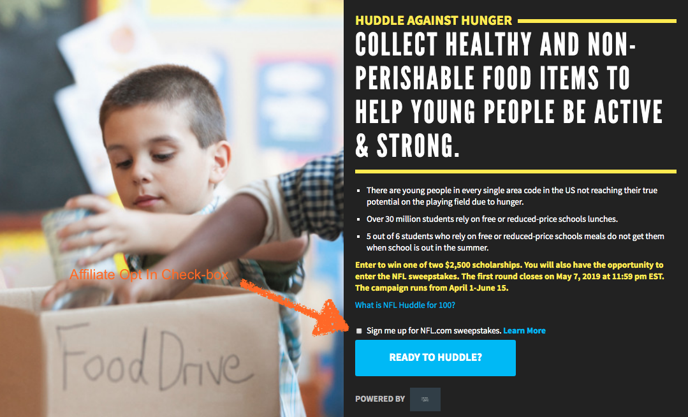

# Affiliate Opt In

The Affiliate Opt In Feature consists of an Opt In Checkbox displayed atop the Signup button in the Lede Banner of a campaign.

This allows a user to opt in to receiving affiliate messaging from the sponsor when signing up.



## Usage Instructions

The Affiliate Opt In Content (`affiliateOptInContent`) Rich Text field on the Campaign Content Type in Contentful controls whether this checkbox shows up, and the text that appears as the label for the checkbox.

If any content is input into this field, the checkbox will automatically appear above the signup button with the content from this field as the label.

## How It Works

When a user checks this field and signs up for the campaign, we append an `affiliateOptIn: true` key/value pair to the signup's `details` object, which is then JSON stringified and sent along to Rogue when creating the signup for the user.

**Example Signup in Rogue**: (note the `affiliateOptIn` in the `details` field)

```js
{
	id: 123,
	northstar_id: "123",
	campaign_id: "123",
	campaign_run_id: null,
	quantity: null,
	quantity_pending: null,
	why_participated: null,
	source: "phoenix-next",
	source_details: null,
	details: "{"campaignContentfulId":"jkl","affiliateOptIn":true}",
	created_at: "2019-04-20 04:20:00",
	updated_at: "2019-04-20 04:20:00",
	deleted_at: null,
}
```

This marks this user as having opted in to receiving affiliate messaging, and can be used to help compile a list of such users for the affiliate partner.

## Under the Hood

Our Redux state is initialized with a `signups` object containing an `affiliateMessagingOptIn` **Boolean** field (defaults to `false`). Clicking the Affiliate Opt In check box input invokes an action which toggles this value.

When the user clicks the Signup button, we use that `signups.affiliateMessagingOptIn` value to determine whether we set the `affiliateOptIn: true` in the `details` field, before triggering the signup request to Rogue.
