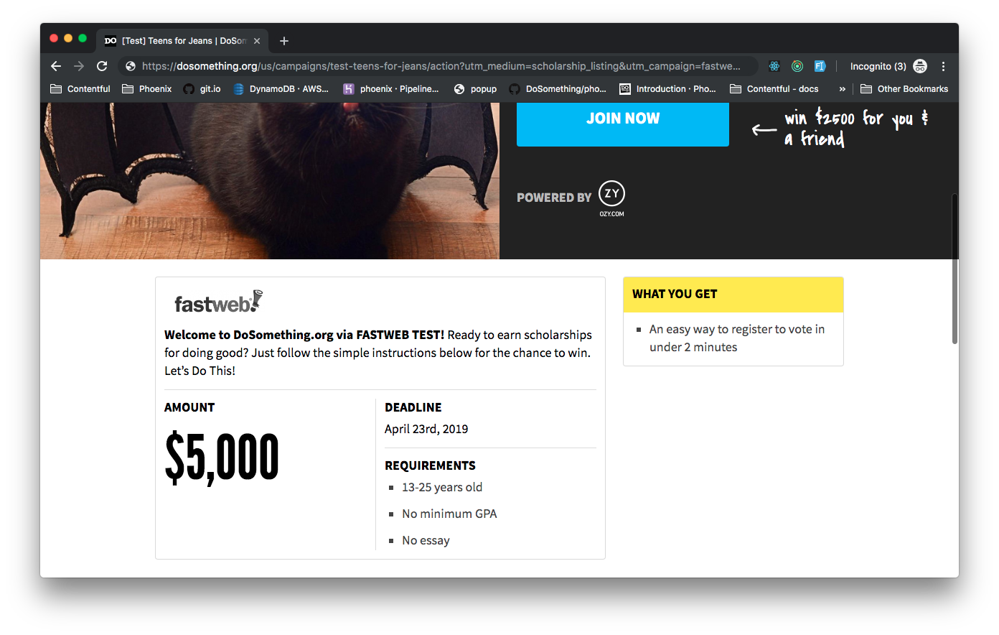

# Affiliate Opt In

## Overview

A sizable amount of site traffic are referrals from affiliate partners -- usually scholarship listing platforms such as [Fastweb](https://www.fastweb.com/).

The Affiliate Scholarship Block displays a card on the Campaign Landing Page containing the referring affiliate partner's logo, title, as well as some pertinent scholarship information.

## Usage Instructions

There are a few separate components controlling what is displayed in the card, as well as controlling whether or not the card will show up for the user:

### UTM Parameters

The URL for the current user will need to contain the following UTM parameters:

- `utm_medium` with a value containing the word `scholarship`. e.g. `utm_medium=scholarship_listing`
- `utm_campaign` with the value of the referring affiliate's UTM label (explained more below). e.g. `utm_campaign=fastweb`

### Affilite info

A Contentful **Affiliate** entry containing the following fields:

- **UTM Label** (`utmLabel`) matching the `utm_campaign` in the URL.
- **Title**
- **Logo**

The **UTM Label** should _exactly_ match the `utm_campaign`, since that's what's used to find the affiliate entry in Contentful. (We've employed a measure to control for mistakenly uppercased values in the `utm_campaign` -- those will be down-cased before searching Contentful.)

### Campaign Scholarship Info

The Campaign entry in Contentful must have the following fields filled in:

- **Scholarship Amount** (`scholashipAmount`)
- **Scholarship Deadline** (`scholarshipDeadline`)

## Under The Hood

The [`LandingPage`](https://github.com/DoSomething/phoenix-next/blob/063c27761b79f7aa1714a6daaffd6b64a1f3aa80/resources/assets/components/pages/LandingPage/LandingPage.js#L37-L42) will pass through the campaign scholarship fields to the [`PitchTemplate`](https://github.com/DoSomething/phoenix-next/blob/063c27761b79f7aa1714a6daaffd6b64a1f3aa80/resources/assets/components/pages/LandingPage/templates/PitchTemplate.js) component. The component then employs the [`getAffiliateScholarshipLabel`](https://github.com/DoSomething/phoenix-next/blob/063c27761b79f7aa1714a6daaffd6b64a1f3aa80/resources/assets/helpers/index.js#L789-L801) helper method to check that the `utm_medium` contains the word `scholarship`, and if so, returns the `utm_campaign`.

If this value is returned, and the scholarship fields are present, the component renders the [`AffiliateScholarshipBlockQuery`](https://github.com/DoSomething/phoenix-next/blob/063c27761b79f7aa1714a6daaffd6b64a1f3aa80/resources/assets/components/blocks/AffiliateScholarshipBlock/AffiliateScholarshipBlockQuery.js) component which uses GraphQL to query for the Affiliate entry matching the `utm_campaign`.

It then renders the [`AffiliateScholarshipBlock`](https://github.com/DoSomething/phoenix-next/blob/063c27761b79f7aa1714a6daaffd6b64a1f3aa80/resources/assets/components/blocks/AffiliateScholarshipBlock/AffiliateScholarshipBlock.js) component with all the information.

If the query encounters an error, or if no affiliate is found, the `AffiliateScholarshipBlock` component will _still_ be rendered absent the affiliate logo and title. (Since under the current conditions we presume the user to benefit from the featured scholarship information.)
