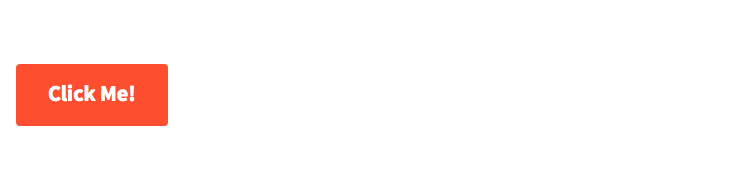
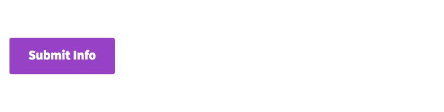
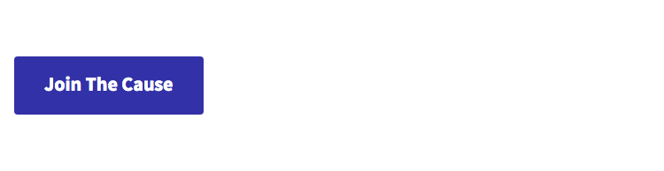
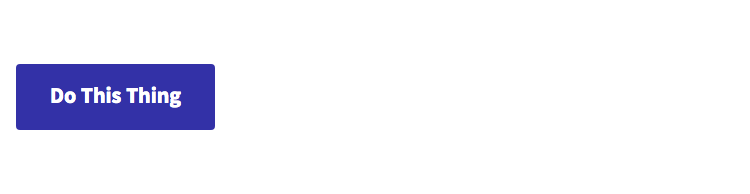
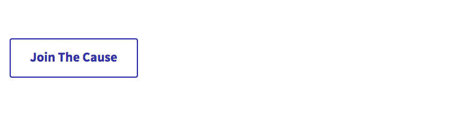
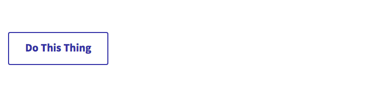
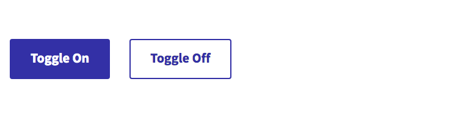

# General Buttons

## Overview

There are currently two **core** button components and the rest of the more specialized button components extend upon these core buttons.

The two core button components are:

- [LinkButton](#linkbutton) \(renders a basic anchor link element `<a>` that looks like a button\)
- [ElementButton](#elementbutton) \(renders a basic button element `<button>`\)

Some of the specialized buttons that extend from the above core button components are:

- [PrimaryButton](#primarybutton)
- [SecondaryButton](#secondarybutton)
- [ToggleButton](#togglebutton)

We'll review what makes each different and how to use them in the following section.

## Usage Instructions

### LinkButton

The `LinkButton` component is one of the **core** button components and if used it will output a very basic button anchor link `<a>` with minimal styles.

When used, you _should_ use Tailwind classes to further style the button, adding a background color and active|focus|hover states, etc.

This component has two required properties:

- `href`: a URL string for the destination link
- `text`: a string for the button text

Example component use:

```js
import LinkButton from '../utilities/Button/LinkButton';

// stuff

<LinkButton
  attributes={{
    target: '_blank',
    'data-label': 'some_useful_data',
  }}
  className="bg-orange-500 active:bg-orange-700 focus:bg-orange-300 hover:bg-orange-300 px-8 py-4 text-lg"
  href="/"
  onClick={trackAnalyticsEvent}
  text="Click Me!"
/>;
```

Example HTML output:

```html
<a
  class="btn bg-orange-500 active:bg-orange-700 focus:bg-orange-300 hover:bg-orange-300 px-8 py-4 text-lg"
  href="/"
  target="_blank"
  data-label="some_useful_data"
>
  Click Me!
</a>
```

Example rendered output:



#### Important Notes

Anchor links in the browser do not support the `disabled` attribute. If added to an `<a>` it does absolutely nothing and the link can still be clicked, thus the `LinkButton` does not support the `isDisabled` property.

If you need a button that can be disabled in the interface, please use a button component that outputs a `<button>` element, like the [ElementButton](#elementbutton) component.

If the `href` URL passed to the `LinkButton` component is an external URL, the component will automatically add appropriate attributes (`target` and `rel`) and values to allow the link to open in a new browser tab. If you do not want an external link to open in a new browser tab, or alternatively, if you want internal links to open in a new browser tab you can override the default behavior by passing the appropriate attributes and values using the `attributes` property. You can see this in `LinkButton` example above.

### ElementButton

The `ElementButton` component is one of the **core** button components and if used it will output a very basic button element `<button>` with minimal styles.

When used, you _should_ use Tailwind classes to further style the button, adding a background color and active|focus|hover states, etc.

This component has one required property:

- `text`: a string for the button text

Example component use:

```js
import ElementButton from '../utilities/Button/ElementButton';

// stuff

<ElementButton
  attributes={{ 'data-label': 'some_useful_data' }}
  className="bg-orange-500 active:bg-orange-700 focus:bg-orange-300 hover:bg-orange-300 px-8 py-4 text-lg"
  isDisabled={isDisabledCheck}
  isLoading={isLoadingCheck}
  onClick={handleOnClick}
  text="Submit Info"
  type="submit"
/>;
```

Example HTML output:

```html
<button
  class="btn bg-purple-500 active:bg-purple-700 focus:bg-purple-300 hover:bg-purple-300 px-8 py-4 text-lg"
  type="submit"
  data-label="some_useful_data"
>
  Submit Info
</button>
```

Example rendered output:



#### Important Notes

By default, the `ElementButton` will output a `<button type="button">` with a `type` of `button`. However, you can pass a `type` property to the component to output a submit button for use in forms as we do in the `ElementButton` example above.

### PrimaryButton

The `PrimaryButton` component outputs a pre-configured "primary styled" button. It extends the `LinkButton` or `ElementButton` depending on the properties supplied, and outputs a link or element button respectively, with all the styling to make it visually render as a "primary styled" button with associated visual states.

Primary buttons have a blurple background and border with white text, along with associated pseudo state styles. You can pass additional Tailwind classes to further style the padding, text size, etc of the button, but you should not be overriding colors and other styles that specifically define it as a primary button.

This component has one required property:

- `text`: a string for the button text

This type of button should be used for clicking to submit data, launch a link to a URL or show/hide interface elements, without changing its visual appearance as a "primary styled" button.

When used to show/hide interface elements, the button will alternate between its default visual appearance and its "active" visual appearance.

#### Usage for PrimaryButton as LinkButton

While only the `text` property is required for the `PrimaryButton`, to generate this button as a `LinkButton` an `href` property is required.

Example component use:

```js
import PrimaryButton from '../utilities/Button/PrimaryButton';

// stuff

<PrimaryButton
  attributes={{ 'data-label': 'some_useful_data' }}
  className="px-8 py-4 text-lg"
  href="/"
  onClick={trackAnalyticsEvent}
  text="Join The Cause"
/>;
```

Example HTML output:

```html
<a
  class="btn bg-blurple-500 border-blurple-500 active:bg-blurple-700 focus:bg-blurple-400 hover:bg-blurple-400 border-2 border-solid active:border-blurple-700 focus:border-blurple-400 hover:border-blurple-400 focus:rounded-none focus:outline-2 focus:outline-blurple-100 focus:outline-solid text-base text-white hover:text-white px-8 py-4 text-lg"
  href="/"
  data-label="some_useful_data"
>
  Join The Cause
</a>
```

Example rendered output:



#### Usage for PrimaryButton as ElementButton

Only the `text` property is required to generate the `PrimaryButton` as an `ElementButton`.

Example component use:

```js
import PrimaryButton from '../utilities/Button/PrimaryButton';

// stuff

<PrimaryButton
  attributes={{ 'data-label': 'some_useful_data' }}
  className="px-8 py-4 text-lg"
  isDisabled={isDisabledCheck}
  isLoading={isLoadingCheck}
  onClick={handleOnClick}
  text="Do This Thing"
/>;
```

Example HTML output:

```html
<button
  class="btn bg-blurple-500 border-blurple-500 active:bg-blurple-700 focus:bg-blurple-400 hover:bg-blurple-400 border-2 border-solid active:border-blurple-700 focus:border-blurple-400 hover:border-blurple-400 focus:rounded-none focus:outline-2 focus:outline-blurple-100 focus:outline-solid text-base text-white hover:text-white px-8 py-4 text-lg"
  type="button"
  data-label="some_useful_data"
>
  Do This Thing
</button>
```

Example rendered output:



### SecondaryButton

The `SecondaryButton` component outputs a pre-configured "secondary styled" button. It extends the `LinkButton` or `ElementButton` depending on the properties supplied, and outputs a link or element button respectively, with all the styling to make it visually render as a "secondary styled" button with associated visual states.

Secondary buttons have a white background with a blurple colored border and text, along with associated pseudo state styles. You can pass additional Tailwind classes to further style the padding, text size, etc of the button, but you should not be overriding colors and other styles that specifically define it as a secondary button.

This component has one required property:

- `text`: a string for the button text

This type of button should be used for clicking to submit data, launch a link to a URL or show/hide interface elements, without changing its visual appearance as a "secondary styled" button.

When used to show/hide interface elements, the button will alternate between its default visual appearance and its "active" visual appearance.

#### Usage for SecondaryButton as LinkButton

While only the `text` property is required for the `SecondaryButton`, to generate this button as a `LinkButton` an `href` property is required.

Example component use:

```js
import SecondaryButton from '../utilities/Button/SecondaryButton';

// stuff

<SecondaryButton
  attributes={{ 'data-label': 'some_useful_data' }}
  className="px-8 py-4 text-lg"
  href="/"
  onClick={trackAnalyticsEvent}
  text="Join The Cause"
/>;
```

Example HTML output:

```html
<a
  class="btn bg-white border-blurple-500 text-blurple-500 active:bg-gray-200 border-2 active:border-blurple-700 hover:border-blurple-300 border-solid focus:rounded-none focus:outline-2 focus:outline-blurple-100 focus:outline-solid text-base active:text-blurple-700 hover:text-blurple-300 px-8 py-4 text-lg"
  href="/"
  data-label="some_useful_data"
>
  Join The Cause
</a>
```

Example rendered output:



#### Usage for SecondaryButton as ElementButton

Only the `text` property is required to generate the `PrimaryButton` as an `ElementButton`.

Example component use:

```js
import SecondaryButton from '../utilities/Button/SecondaryButton';

// stuff

<SecondaryButton
  attributes={{ 'data-label': 'some_useful_data' }}
  className="px-8 py-4 text-lg"
  isDisabled={isDisabledCheck}
  isLoading={isLoadingCheck}
  onClick={handleOnClick}
  text="Do This Thing"
/>;
```

Example HTML output:

```html
<button
  class="btn bg-white border-blurple-500 text-blurple-500 active:bg-gray-200 border-2 active:border-blurple-700 hover:border-blurple-300 border-solid focus:rounded-none focus:outline-2 focus:outline-blurple-100 focus:outline-solid text-base active:text-blurple-700 hover:text-blurple-300 px-8 py-4 text-lg"
  type="button"
  data-label="some_useful_data"
>
  Do This Thing
</button>
```

Example rendered output:



### ToggleButton

The `ToggleButton` component outputs a pre-configured button that is capable of being toggled on and off. It extends the `ElementButton` component and outputs an element button, with all the styling to make it visually render as a "primary styled" button with associated visual states when toggled off and as a "secondary styled" button with associated visual states when toggled on.

This component has two required properties:

- `activateText`: a string displayed when toggled off; to indicate clicking will activate
- `deactivateText`: a string displayed when toggled on; to indicate clicking will decactivate

This type of button should be used specifically for toggling data items that distinctly have both an "on" and an "off" state. Examples would include "subscribing" or "unsubscribing" from an email newsletter, or to allow users to "follow" or "unfollow" a cause space.

The use case above, indicating the requirements of an on/off state is what separates the `ToggleButton` from how `PrimaryButton` and `SecondaryButton` can be used to show/hide interface elements.

Example component use:

```js
import ToggleButton from '../utilities/Button/ToggleButton';

// stuff

<ToggleButton
  activateText="Toggle On"
  attributes={{ 'data-label': 'some_useful_data' }}
  className="px-8 py-4 text-lg"
  deactivateText="Toggle Off"
  isDisabled={isDisabledCheck}
  isLoading={isLoadingCheck}
  isToggled={isToggledCheck}
  onClick={handleOnClick}
/>;
```

Example HTML output:

```html
// when toggled off

<button
  class="btn bg-blurple-500 active:bg-blurple-700 focus:bg-blurple-400 hover:bg-blurple-400 border-2 border-solid border-blurple-500 active:border-blurple-700 focus:border-blurple-400 hover:border-blurple-400 focus:rounded-none focus:outline-2 focus:outline-blurple-100 focus:outline-solid text-base text-white hover:text-white px-8 py-4 text-lg"
  type="button"
  data-label="some_useful_data"
>
  Toggle On
</button>
```

```html
// when toggled on

<button
  class="btn bg-white active:bg-gray-200 border-2 border-blurple-500 active:border-blurple-700 hover:border-blurple-300 border-solid focus:rounded-none focus:outline-2 focus:outline-blurple-100 focus:outline-solid text-base text-blurple-500 active:text-blurple-700 hover:text-blurple-300 ml-8 px-8 py-4 text-lg"
  type="button"
  data-label="some_useful_data"
>
  Toggle Off
</button>
```

Example rendered output:


