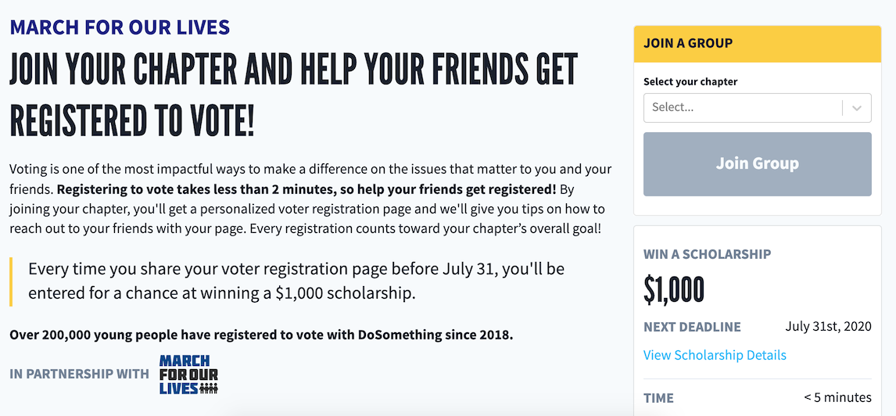
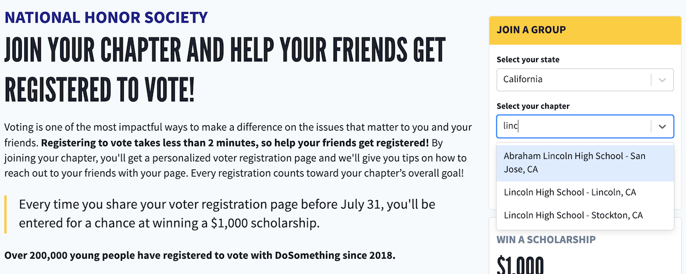

# Groups

If a Rogue campaign is configured with a [group type](https://activity.dosomething.org/group-types), a Group Finder will appear on the campaign landing page. Members must select a group to join in order to signup for the campaign (which will save their selected group ID to their signup).

## Group types

If a group type's `filter_by_location` boolean attribute is `true`, the Group Finder will require the member to select their group state first before searching for the group name.

By default the Group Finder will label a group as a "school", e.g. "Find your school". To override this label as "chapter", add the group type ID to the Phoenix `CHAPTER_GROUP_TYPE_IDS` site configuration variable.

## Online Voter Registration Drives

Group types may run their own [Online Voter Registration Drive (OVRD)](development/features/voter-registration.md#online-drives) campaigns. A [VoterRegistrationDriveAction](development/content-types/voter-registration-drive-action.md) used on an action page of a groups campaign will append the alpha's selected `group_id` as a query parameter to their OVRD page, e.g:

> /us/my-voter-registration-drive?group_id=172&referrer_user_id=5547be89469c64ec7d8b518d

When betas register to vote via an alpha's link that contains a `group_id`, our [importer app](development/features/voter-registration.md#import) will populate the voter-reg post with the alpha's `group_id` as well as the alpha's `referrer_user_id`. This allows us to count the total number of people each group has gotten to register to vote.
