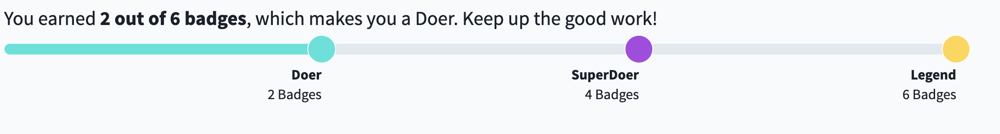

# Progress Bar

## Overview

This is a feature built out to showcase a campaign or actions progress on our site!

## Usage Instructions

### Progress Bar

The `ProgressBar` component is a **base** component for any use case and if used on its own it will output a basic progress bar.

It will have set styling with _tailwind yellow_ as the bar color.

This component has one required property:

-   `percentage`: a number for the bar to use as the amount filled in (it is assigned to a width property)

Example component use:

```js
import ProgressBar from '../ProgressBar/ProgressBar';

// the getGoalInfo helper is used here to generate the percentage number
const { goal, percentage } = getGoalInfo(
    displayedImpactGoal,
    currentImpactTotal,
);
// stuff

<ProgressBar percentage={percentage} />;
```

Example HTML output:

```html
<div class="relative bg-gray-200 css-trp91u">
    <div class="css-19srif4" style="width: 30%;"></div>
</div>
```

### MultiLevel Progress Bar

The `MultiLevelProgressBar` component is another **base** component for any use case that requires more than one percentage to be displayed.

The syling of the component itself is set, but its child components - the `SingleLevel` - can be customized using TailWind and EmotionJS.

This component has two required properties:

-   `children`: object(s) that display the sections of percentages. Intended to be the `SingleLevel` component found in the same file.
-   `levelLabels`: An object with two sub fields: `label` and `sublabel` to help give context to the different sections.

Example component use:

```js
import MultiLevelProgressBar, {
    SingleLevel,
} from '../../../utilities/ProgressBar/MultiLevelProgressBar';

// stuff

<MultiLevelProgressBar
    levelLabels={[
        {
            label: 'Doer',
            subLabel: '2 Badges',
        },
        {
            label: 'SuperDoer',
            subLabel: '4 Badges',
        },
        {
            label: 'Legend',
            subLabel: '6 Badges',
        },
    ]}
>
    <SingleLevel
        levelProgress={doerProgress(totalBadges)}
        color="bg-teal-500"
    />
    <SingleLevel
        levelProgress={superDoerProgress(totalBadges)}
        color="bg-purple-400"
    />
    <SingleLevel
        levelProgress={legendProgress(totalBadges)}
        color="bg-yellow-400"
    />
</MultiLevelProgressBar>;
```

Example HTML output:

```html
<div>
    <div
        class="grid grid-cols-3 bg-gray-300 pr-4 lg:pr-0 mb-3 w-full css-iub91h"
    >
        <div class="relative">
            <div class="bg-teal-500 h-full css-1yvuksy"></div>
            <div
                class="bg-teal-500 h-8 w-8 absolute border border-solid border-white rounded-full z-10 css-1tky4z"
            ></div>
        </div>
        <div class="relative">
            <div class="bg-purple-400 h-full css-1ofkc3p"></div>
            <div
                class="bg-purple-400 h-8 w-8 absolute border border-solid border-white rounded-full z-10 css-1tky4z"
            ></div>
        </div>
        <div class="relative">
            <div class="bg-yellow-400 h-full css-1ofkc3p"></div>
            <div
                class="bg-yellow-400 h-8 w-8 absolute border border-solid border-white rounded-full z-10 css-1tky4z"
            ></div>
        </div>
    </div>
    <div class="grid grid-cols-3 pr-4 lg:pr-0 mb-10 w-full">
        <div class="text-right">
            <span class="font-bold">Doer</span> <br />
            2 Badges
        </div>
        <div class="text-right">
            <span class="font-bold">SuperDoer</span> <br />
            4 Badges
        </div>
        <div class="text-right">
            <span class="font-bold">Legend</span> <br />
            6 Badges
        </div>
    </div>
</div>
```

## Current Iteration

Currently the Progress bar is used in 3 different places.

1. On the Rewards Tab
2. On the Campaign Landing Page
3. On Voter Registration specific Referral Pages

### Rewards Tab

On the rewards tab of each user's account, a progress bar is displayed to indicate what level they have reached as a user. This is implemented with the `RewardsProgressBar`, which uses the `MultiLevelProgressBar` as a base.



### Campaign Landing Pages

A progress bar will be displayed on a campaign landing page if the campaigns main action is a photo submission action. This is because photo submissions generally include a `quantity` field we can reference to generate a percentage. The progress bar here is used within a `CampaignProgressBar` component that makes a query for the numbers we need to fill the progress bar.


### OVRD Referral Pages

In this case, we are directly using the `ProgressBar` to display the goal of how many people have been registered to vote either by a group (College Board etc) or an individual. These registrations are tracked as referrals and the progress bar shows how many have been recieved versus the final goal number. This is still implemented in code but not in use actively on the site since it was part of a GOTV specific initiative in 2020.


## Original Use Cases

Progress bar was first implemented for our OVRD referral pages in 2020. For this reason, some helpers for the calculations are located in voter registration helper files.

## Additional Information

The `ProgressBar` and `MultiLevelProgressBar` are the two main files that should be used when displaying the progress bar. If there is specific data or functionality that either is missing, it most likely makes sense to create a wrapper component, similar to the way the `CampaignProgressBar` was built.
