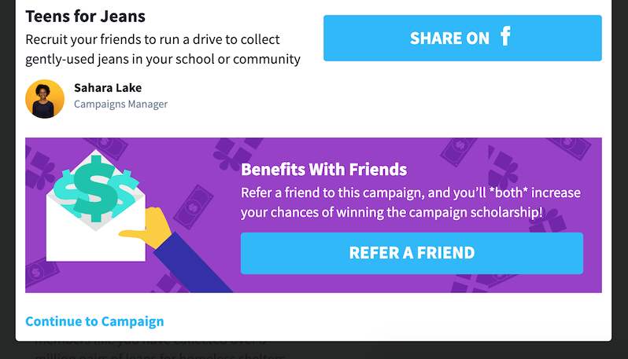
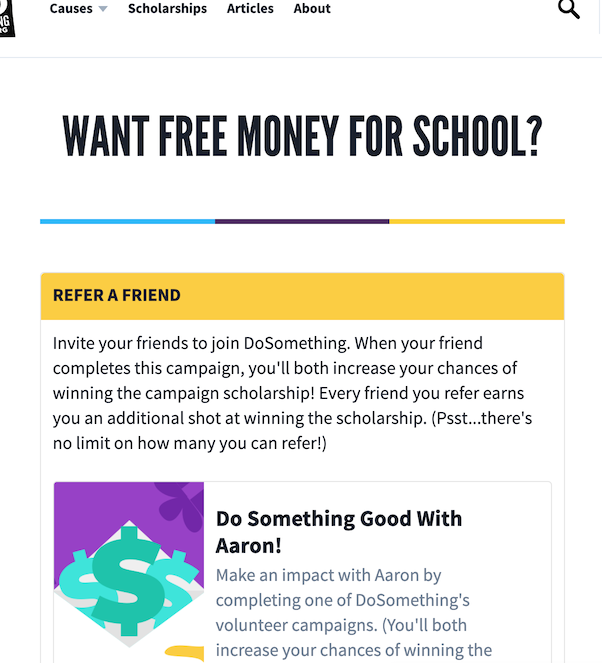
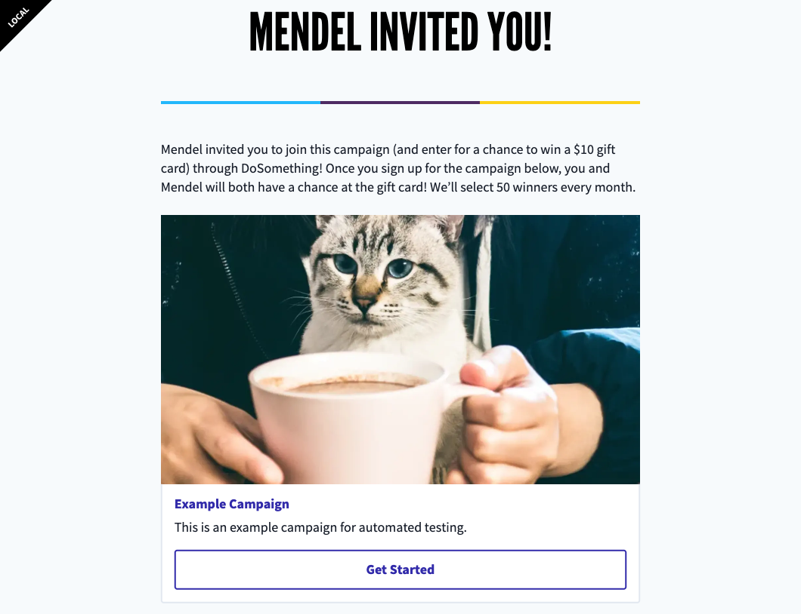

# Refer A Friend

## Overview

The Refer A Friend Feature provides members with a unique URL to share with their friends, to get them to register and signup for a campaign on DoSomething.org.

We commonly use these terms (in the business, and in code) when describing this feature:

- **Alpha** - The user who is sharing the URL with friends, prompting the friends to register
- **Beta** - The friends that the alpha is sharing the URL with

Both the alpha and beta may earn a reward for the beta registering and signing up for the campaign.

This feature is currently only live on the Teens For Jeans 2019 campaign, offering a second scholarship entry as the reward. Users who have `refer-friends-scholarship` feature flag set will see a Referral Page Banner after signing up for Teens For Jeans 2019, which refers them to their Alpha Referral Page.

## Details

This feature is hardcoded, and consists of three user-facing touch points:

### Referral Page Banner

After signing up for Teens For Jeans 2019, users who have the `refer-friends-scholarship` flag set will see a Referral Page Banner within the signup Affirmation, which links to their Alpha Referral Page.



### Alpha Referral Page

```
dosomething.org/us/refer-friends
```

The user's Alpha Referral Page prompters the user to share their Beta Referral Page with their friends. The Beta Referral Page URL will contain the user's ID as a `user_id` query parameter.



### Beta Referral Page

```
dosomething.org/join?user_id=55767609a59dbf3c7a8b4571
```

The Beta Referral Page links to campaigns that the beta should join, in order to receive the reward along with the alpha (which is set via the `user_id` query parameter).



The campaign URLs will include the alpha's user ID as a `referrer_user_id` query parameter:

```
https://www.dosomething.org/us/campaigns/teens-jeans?referrer_user_id=5547be89469c64ec7d8b518d
```

This `referrer_user_id` query parameter will be added to the `source_detail` of any new user accounts created by betas.

## Iterations

The previous (and first) iteration of Refer A Friend offered a \$5 gift card reward to any beta who registered and signed up for a staff pick campaign, as well as the alpha that referred them. The Referral Page Banner would only display for users with the `refer-friends` feature set.

The list of campaigns to display the Referral Page Banner for was hardcoded into the codebase. The Beta Referral Page URL would include a `campaign_id` query parameter, e.g.:

```
dosomething.org/us/join?user_id=:userId&campaign_id=9037
```

If this campaign ID matched a hardcoded referral page campaign, we'd link to this campaign in the first block on the Beta Referral Page.

If we want to add multiple referral campaigns again in the future, we should add a new boolean property to the Rogue campaign that indicates whether the campaign is a referral campaign.
