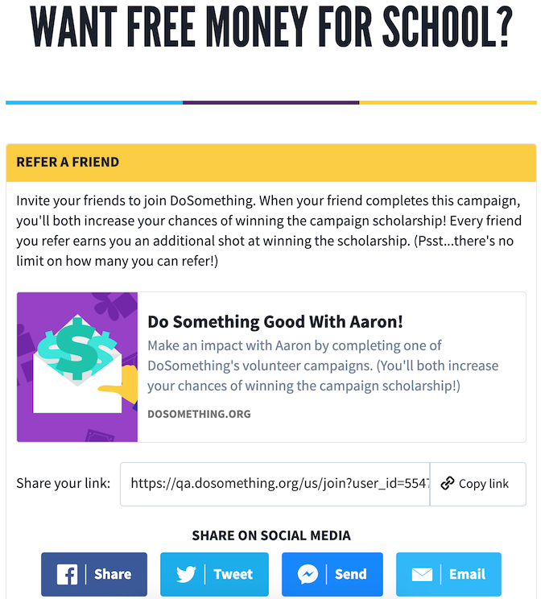
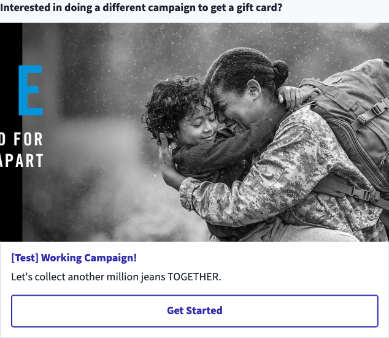

# Refer A Friend

## Overview

The Refer A Friend (RAF) Feature provides members with a unique URL to share with their friends, to get them to register and signup for a campaign on DoSomething.org.

We commonly use these terms (in the business, and in code) when describing this feature:

- **Alpha** - The user who is sharing the URL with friends, prompting the friends to register
- **Beta** - The friends that the alpha is sharing the URL with

We currently do not offer any reward for referrals. We anticipate introducing a new iteration of a reward in August, but for now we're in a 'soft-launch' reward-less phase of RAF. Previous iterations of this feature did offer rewards, see History.

Users will see a Referral Page Banner after signing up for any campaign configured for this feature, which refers them to their Alpha Referral Page.

## Details

To opt a campaign into the referral feature, its `displayReferralPage` field should be set to `true`.

### Referral Page Banner

After signing up for the campaign, users will see a Referral Page Banner within the signup Affirmation, which links to their Alpha Referral Page.


### Alpha Referral Page

```
dosomething.org/us/refer-friends?campaign_id=123
```

The user's Alpha Referral Page prompts the user to share their Beta Referral Page with their friends. The Beta Referral Page URL will contain the user's ID as a `user_id` query parameter as well as the `campaign_id` containing the referral campaign.



If the `campaign_id` query parameter is missing completely, the campaign will default to the assigned `DEFAULT_REFERRAL_CAMPAIGN_ID` variable for the application. (If this variable is not assigned, the campaign link will display an error).

### Account Alpha Referral Page

```
dosomething/us/account/refer-friends
```

Users can visit their account RAF tab for a similar experience to the canonical Alpha Referral Page.

The `campaign_id` query parameter for their share URL will be the assigned `DEFAULT_REFERRAL_CAMPAIGN_ID`. This can also be overwritten via a `campaign_id` query parameter: `dosomething/us/account/refer-friends?campaign_id={ID}`

The page will also display a gallery of the user's beta referrals, or more specifically: a unique list of users who have signed up for a campaign with the users referral link (i.e. their signup contains a `referrer_user_id` with the user's Northstar ID).


### Beta Referral Page

```
dosomething.org/join?user_id=55767609a59dbf3c7a8b4571&campaign_id=123
```

The Beta Referral Page links to the campaign that the beta should join (set via the `campaign_id` query parameter), in order to receive the reward along with the alpha (which is set via the `user_id` query parameter).


We also display a secondary campaign link using the configured `DEFAULT_REFERRAL_CAMPAIGN_ID`.



If the `campaign_id` query parameter matched this assigned default, we'll only display the primary link. If the `campaign_id` query parameter is missing completely, we'll similarly pull the default ID and display it _as_ the primary link.

The campaign URLs that the Beta Page links to will include the alpha's user ID as a `referrer_user_id` query parameter:

```
https://www.dosomething.org/us/campaigns/teens-jeans?referrer_user_id=5547be89469c64ec7d8b518d
```

This `referrer_user_id` query parameter will be added to the `referrer_user_id` of any new user accounts created by betas, as well as appended to the campaign signup or reportback submitted when the query parameter is attached.

## Iterations

#### RAF Version 0

The first iteration of Refer A Friend (RAF) offered a \$5 gift card reward to any beta who registered and signed up for a staff pick campaign, as well as the alpha that referred them. The Referral Page Banner would only display for users with the `refer-friends` feature set.

The list of campaigns to display the Referral Page Banner for was hardcoded into the codebase. The Beta Referral Page URL would include a `campaign_id` query parameter, e.g.:

```
dosomething.org/us/join?user_id=:userId&campaign_id=9037
```

If this campaign ID matched a hardcoded referral page campaign, we'd link to this campaign in the first block on the Beta Referral Page.

#### RAF Version 1

The second iteration of RAF allowed the list of campaigns (as well as the default campaign) to be configured via environment variable feature flags. This was deprecated in [#1940](https://github.com/DoSomething/phoenix-next/pull/1940) by the addition of the `displayReferralPage` field. The Referral Page Banner in the campaign signup affirmation was still only exposed to _new_ users who were assigned the `refer-friends-scholarship` feature flag.

#### RAF Version 2

In anticipation of launching a fully formalized version of RAF, we deprecated the `refer-friends-scholarship` feature flag, and exposed the RAF CTA Banner to _all_ users signing up for a campaign opted into RAF in the Referral Page Banner.

And now, having actually soft-launched the RAF V2 iteration, we've deprecated the scholarship reward completely, and simply offer the RAF functionality, sans reward copy.
