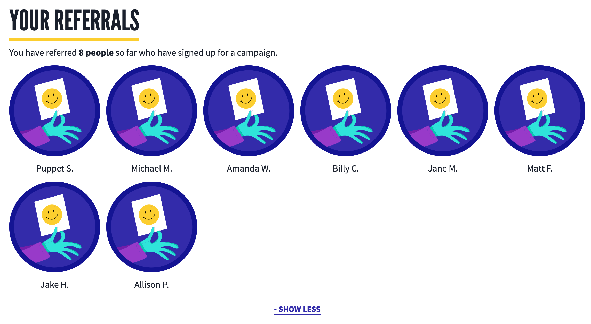
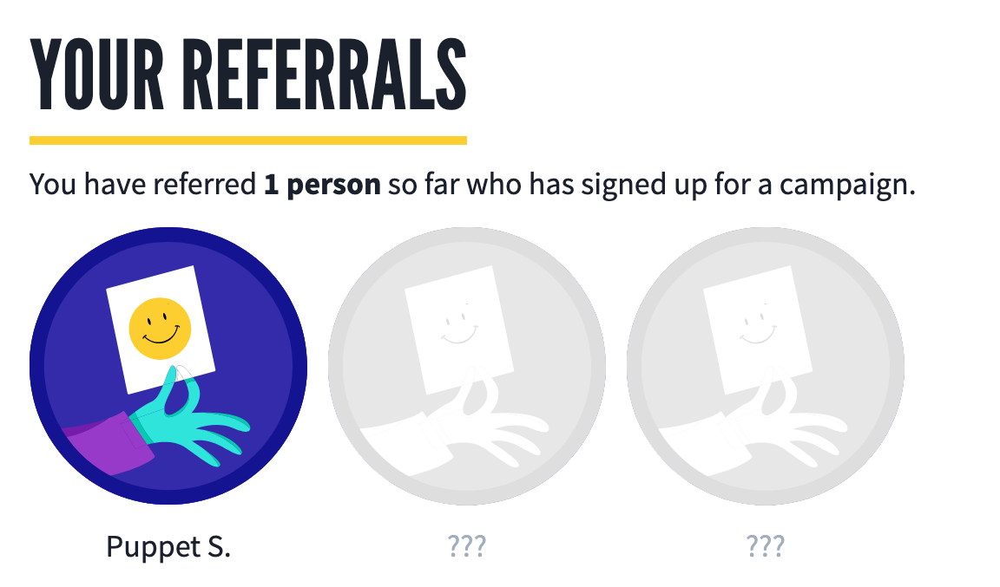

# Referrals Gallery

## Overview

The `ReferralsGallery` utility component displays a - truncated but expandable - gallery of labeled icons pertaining to a users referrals.

In our business logic, this would generally mean fetching a list of posts or signups with a `referrer_user_id` matching the current user, parsing out the referred user's **Display name**s, and passing that list as the `referralLabels` to the Referrals Gallery.

The gallery will render the referral labels under the `referralIcon` in a truncated list of three. It will also display a link showing the additional count of referrals ('+ n more') which, when clicked, will expand the gallery to display the full list, with the link converting to a 'view less' link which will collapse the gallery when clicked.




If 0-2 referral labels are passed to the gallery, it will display up to 3 placeholder labels under a list of the assigned `placeholderIcon` icon. (With _no_ additional count link, of course).



## Usage Instructions

```js
import ReferralIcon from './referral-icon.svg';
import PlaceholderIcon from './placeholder-icon.svg';

const signupReferrals = [
  { id: 1, user: { displayName: 'Michael M.' } },
  { id: 2, user: { displayName: 'Amanda W.' } },
  { id: 3, user: { displayName: 'Billy C.' } },
  { id: 4, user: { displayName: 'Jane M.' } },
  { id: 5, user: { displayName: 'Matt F.' } },
];

<ReferralsGallery
  referralLabels={referrals.map(referral => referral.user.displayName)}
  referralIcon={ReferralIcon}
  placeholderIcon={PlaceholderIcon}
/>;
```
