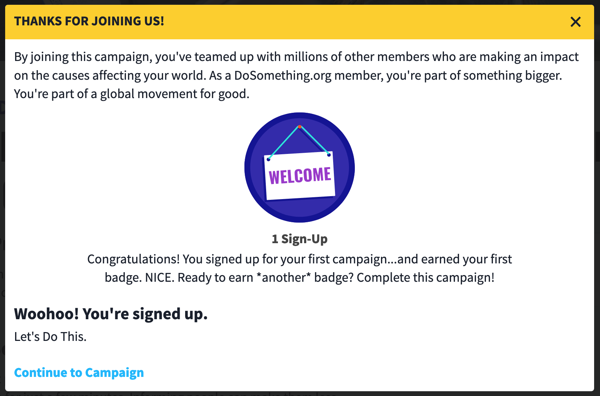
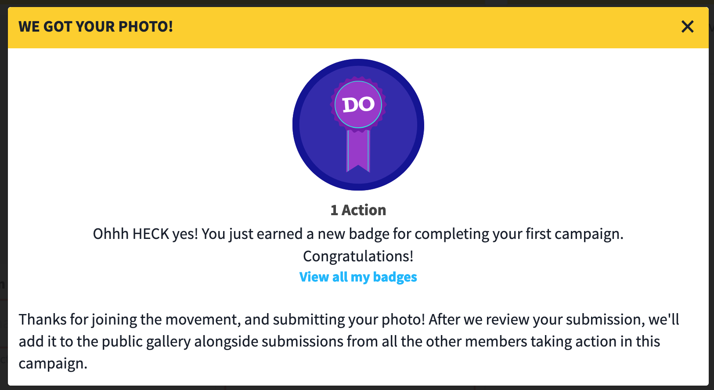

# Rewards

## Overview

Our rewards page lets users know how many badges they've earned, and what level they have reached based on those badges! Badges are awarded to users based on actions they have taken.

## Current Badges

Unless specified, badges will only show up in the Badges tab of the user profile.

-   **1 Signup** - Awarded after the user's first signup. This will also show up in the signup affirmation modal.
-   **1 Action** - Awarded after the user's first post is submitted. This will also show up in the reportback affirmation modal.
-   **2 Actions** - Awarded after the user's second post is submitted. This will also show up in the reportback affirmation modal.
-   **3 Actions** - Awarded after the user's third post is submitted. This will also show up in the reportback affirmation modal.
-   **1 Staff Fave** - This badge remains hidden until earned. Awarded when a post gets tagged with `good-submission`.
-   **2 Staff Faves** - This badge remains hidden until earned. Awarded when a second post gets tagged with `good-submission`.
-   **3 Staff Faves** - This badge remains hidden until earned. Awarded when a third post gets tagged with `good-submission`.
-   **News Expert** - Awarded when a user's `email_subscription_topics` contains "news" (which means that they are subscribed to The Breakdown)

## Viewing Badges

### Profile

Users will have a "Rewards" tab in their profile. Clicking on a badge pulls up a modal which gives more information on how a badge was earned or how to earn it.

### Signup Affirmation Modal

If a user earns a badge upon signing up for a campaign, the badge will be displayed in the signup affirmation modal.

### Reportback Affirmation Modal

If a user earns a badge upon submitting a post, it will show up in the `PostCreatedModal`.

## Iterations

### Badges Version 1

This verions opts 70% of _new_ users into the badge experience, unless excluded (club referrals are excluded as are users from certain campaigns).

The "badges" experience is still a test, and only [a subset of new users](#who-gets-badges) are opted-in.

#### Who Gets Badges

Only new users get the badge experience, but there are some exceptions. All of the following logic takes place in _Northstar_.

The following users will NOT have a chance to be opted-in to the badges experience:

-   Users who have `utm_source:clubs` in their `source_detail`
-   Users who have particular campaigns in their `source_detail` (these excluded campaigns come from the `DS_CONTENTFUL_IDS_FOR_CAMPAIGNS_WITH_NO_BADGES` feature flag in _Northstar_) - currently the only excluded campaign is for teachers, who do not need badges

The `DS_BADGES_TEST` feature flag in _Northstar_ is what toggles the currently running badge _test_ on and off, it does _not_ toggle the badge feature itself. The badge feature is controlled by the `badges` feature flag that lives on a user in Northstar. When `DS_BADGES_TEST` is `true`, that means that some users in Northstar are getting `badges` added to their `feature_flags`. Users who have the badges feature flag will _always_ get the badges experience. _Phoenix_ checks if a user has the badges feature flag before displaying any badge related content.

In this version _badges are not stored anywhere_. Each time we display a badge, we are calculating on the fly if the user has earned that badge. The good thing about this is that we don't have to worry about revoking badges (like if someone unsubscribes from The Breakdown) because that will happen automatically. The bad thing is that there is no easy way to answer questions like "How many badges does this user have?"

There is currently no easy way for an admin to see which badges a user has, though they can see if users are getting the badges experience or not.

### Badges Version 1.2 (current version)

In this version all users are able to see badges within their profile, but the other aspects of version 1 remain in tact (calculating on the fly, etc).

### Badges Version 2 aka Levels

In the next iteration of badges, we are also rolling out different levels of membership that users can reach! Because of this, we're considering the "badges" tab the "rewards" tab. Users can now use the badges they accumulate to get special rewards to use on our site. In this first iteration of "rewards," users will gain additional scholarship entries on campaigns they participate in that have a scholarhsip attached.

### Current Levels

-   **Doer** - Achieved after receiving 2 badges.
-   **SuperDoer** - Achieved after receiving 4 badges.
-   **Legend** - Achieved after receiving 6 or more badges.

### Retired Badges (badges in a past life)

-   **Registered Voter** - Awarded when a user's `voter_registration_status` is `CONFIRMED` (they told us they are registered) or `REGISTRATION_COMPLETE` (they registered through us)
