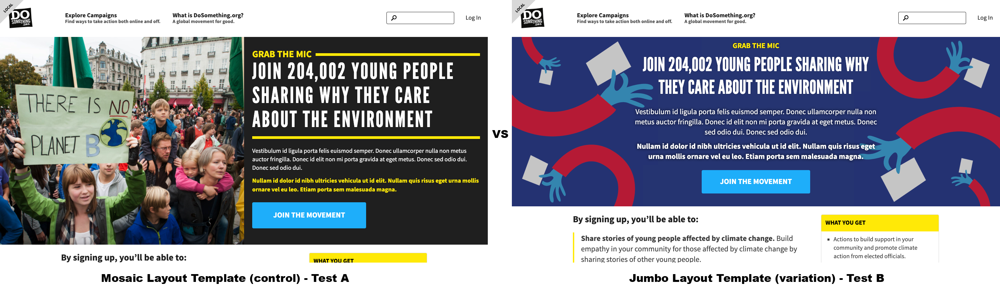

# Sixpack Code Tests

As an example to help with describing the steps involved, lets consider a Sixpack A/B Test Experiment to test between two alternative variations of the template used for the lede banner on the campaign landing page.



To create a Sixpack A/B Test Experiment in code, you first need to determine the component that would be overridden to render out each alternative to be tested.

Since we would be testing multiple variations of the rendered output of the `LedeBannerContainer` component, we would need to make changes in the `LandingPage` component, which is where the `LedeBannerContainer` component is called and output.

To perform the A/B Test Experiment, we would need to replace the `LedeBannerContainer` component with a `SixpackExperiment` component found in the [`/resources/assets/components/utilities/SixpackExperiment/`](https://github.com/DoSomething/phoenix-next/tree/master/resources/assets/components/utilities/SixpackExperiment) directory, and instead pass the `LedeBannerContainer` variations as array items in the `alternatives` property of the `SixpackExperiment`:

```javascript
// /resources/assets/components/pages/LandingPage/LandingPage.js

const LandingPage = props => {
  // Placed within the returned JSX/HTML output.

  return (
    <SixpackExperiment
      title="LedeBanner Layout Experiment"
      // The mosaic template is the control, or default test alternative.
      control={<LedeBannerContainer testName="Mosaic Layout Template" />}
      convertableActions={['signup']}
      alternatives={[
        // The jumbo template is the alternative to test against the control.
        <LedeBannerContainer
          testName="Jumbo Layout Template"
          coverImage={{ url: 'https://example.org/jumbo-template-image.png' }}
          template="jumbo"
        />,
      ]}
    />
  );
```

Each component passed as a test alternative needs to specify a `testName` property to help distinguish between the different alternatives; a short yet descriptive name is ideal. This `testName` property will be used by the `SixpackExperiment` component to generate the snake-cased name for the test in the Sixpack web administrative user interface.

When using components for test alternatives that utilize a container, it is required that the container component code be updated so when mapping state to props, the properties can be overridden by properties specified when calling the component container in the `SixpackExperimentContaienr`.

In the example above, the `LedeBannerContainer` overrides the `coverImage` and `template` properties, specifiying values specific for the test alternative. The `LedeBannerContainer` allows using these overriding values, but defaults to the values provided in the Redux Store state if none are specified:

```javascript
// /resources/assets/components/LedeBanner/LedeBannerContainer.js

/**
 * Provide state from the Redux store as props for this component.
 */
const mapStateToProps = (state, props) => ({
  // ...
  coverImage: get(props, 'coverImage', state.campaign.coverImage),
  template: get(props, 'template', state.campaign.template),
  // ...
});
```

This means, that for the "Jumbo Layout Template" test alternative, a different cover image and a different template will be used for that test, overriding the expected "control" values for the default rendered output.

The only other requirement for the `SixpackExperiment` is to provide a `title` property to name the overall experiment, along with a `convertableActions` property with an array of one or more strings specifying the different actions that trigger converting on a test alternative for the experiment, like `signup`, `reportback`, etc.

After that, the rest of the behavior follows what is specified in the [Sixpack A/B Testing - Under The Hood](sixpack-a-b-testing.md#under-the-hood) section regarding experiment participation and conversion.


If you need to isolate a Sixpack Experiment in code to only run in a particular condition, you will likely need to wrap the `SixpackExperiment` component within a conditional. For example, if you want the Lede Banner template experiment to run on only a specific campaign instead of all campaigns, you may need to include a conditional to check against the Campaign ID or Contentful ID.

