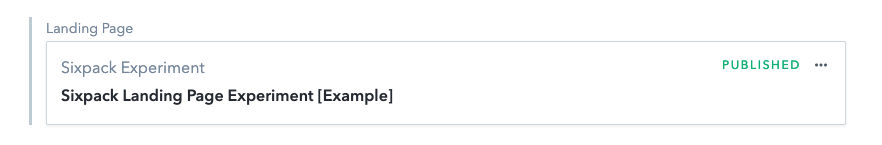
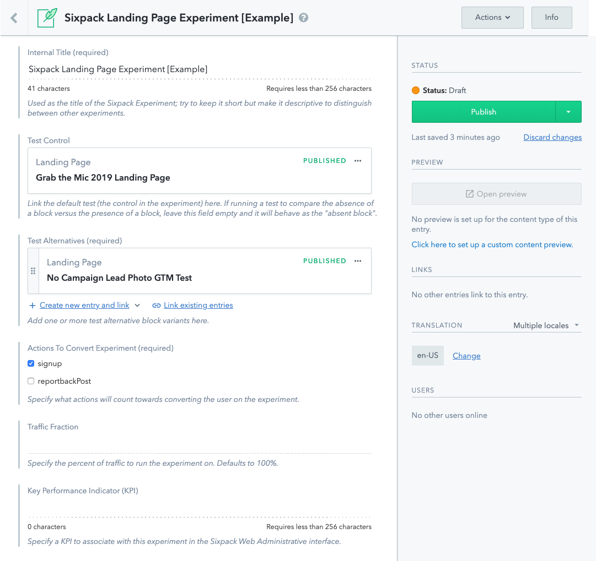

# Sixpack Contentful Tests

As an example to help with describing the steps involved, lets consider a Sixpack A/B Test Experiment to test between two alternative variations of the content used on a campaign landing page.

Within Contentful, you can only create a Sixpack A/B Test Experiment within "reference fields". Reference fields in Contentful are fields that allow you to link to and reference a content entry in the system. For example, the "Landing Page" field on a Campaign in Contentful is a reference field:

The reference field gives you the option to create a new entry and link it to the field on the fly, or just link to an entry that already exists in the system.

To create a new Sixpack A/B Test Experiment in Contentful, you would first need to create a new **Sixpack Experiment** content type instance and link it to the aforementioned reference field that you want to run the A/B experiment. If there is already a content type linked to the reference field, this Sixpack Experiment instance would replace the existing entry.

For this example, since we would be testing multiple variations of the content provided for the campaign landing page, we will need to provide the campaign with 2 different landing page alternatives. To do so, we would need to add a Sixpack Experiment content type instance to the `landingPage` field on the Campaign content type and create 2 Landing Page content types to link to _within_ the Sixpack Experiment content type.

