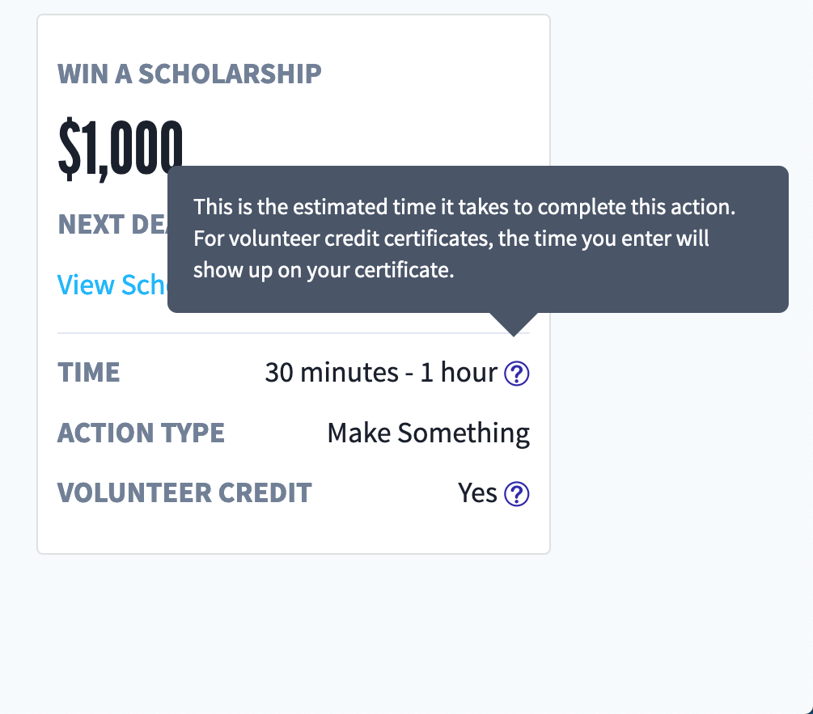

# Tooltip

## Overview

The `Tooltip` utility component will display a tooltip adjacent to a 'target' element, triggered by user interaction:

#### Large Screens

**Hover**:
The tooltip will be triggered by hovering over the target. Once the user unhovers, the tooltip will disappear after 1 second. But if the user hovers over the tooltip content, the tooltip won't disappear until they've unhovered the content.

**ENTER**:
For accessiblity, the tooltip target can be 'focused' (via TABBING through to the element), and when ENTER is clicked, the tooltip content will appear.

#### Small Screens

**Click**: For mobile / touchscreen devices, the tooltip will be triggered via clicking the tooltip target. The tooltip content will disappear when the user scrolls.

## Usage Instructions

The `Tooltip` component expects a `tooltipContent` prop (text or JSX) with the content appearing within the tooltip. The tooltip target content should be rendered as children of the `Tooltip`:

```jsx
<Tooltip
    tooltipContent={<p>I'm your neighberhood friendly tooltip content!</p>}
>
    <button>Hover over me please!</button>
</Tooltip>
```

## Under the hood

We use the [React Tiny Popover](https://github.com/alexkatz/react-tiny-popover) library to render the tooltip.


