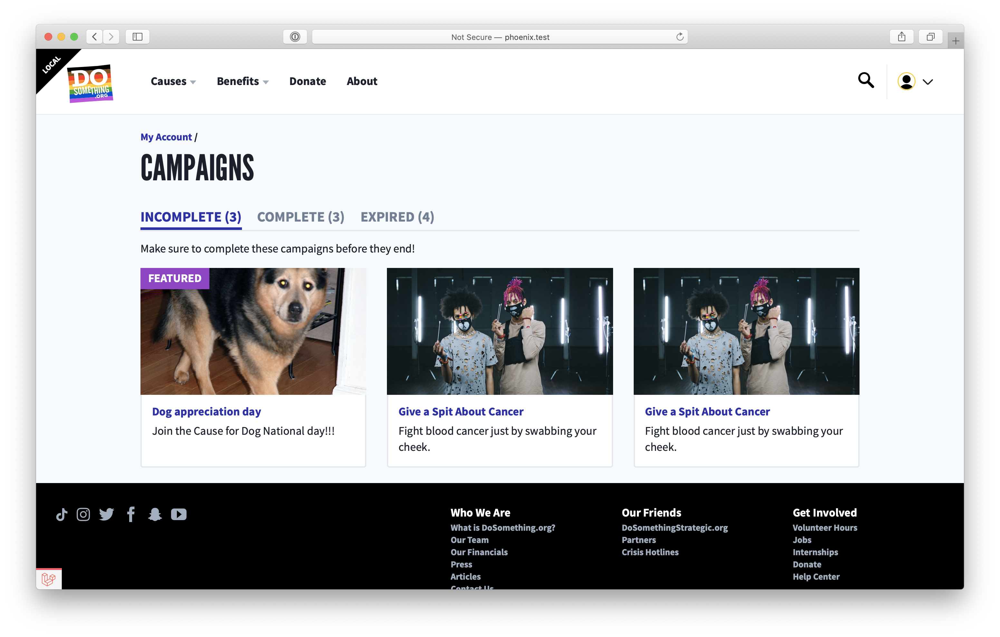

# User Campaigns Page

## Overview

The user campaigns page (`/us/account/campaigns`) provides a list of the user's campaigns (for which they've signed up), categorized by completion status.

We parse the campaigns into three categories, which are separated into tabs:

-   Incomplete (`/us/account/campaigns/incomplete`): Campaigns for which the user has signed up, but has not completed the reportback (the reportback much be for either the _scholarship_ qualifying action if applicable or just the _reportback_ qualifying action on the campaign), and where the campaigns are still open. This tab is displayed by default
-   Completed (`/us/account/campaigns/complete`): Campaigns for which the user has completed the reportback
-   Expired (`/us/account/campaigns/expired`): Campaigns for which the user has signed up, but not completed the reportback, and are now closed. This tab will not display if there are no expired campaigns

## Under the hood

Since the campaign signup categorization is rather involved, and we don't currently have the infrestructure on our Northstar API backend to handle this categorization, we run a rather large GraphQL query when loading this page to fetch: the user's Signups, associated Campaign (+ Website Campaign), Action's, & Post's. We then use the [`groupUserCampaignSignups`](https://git.io/JcbYf) helper method to group the campaigns.
