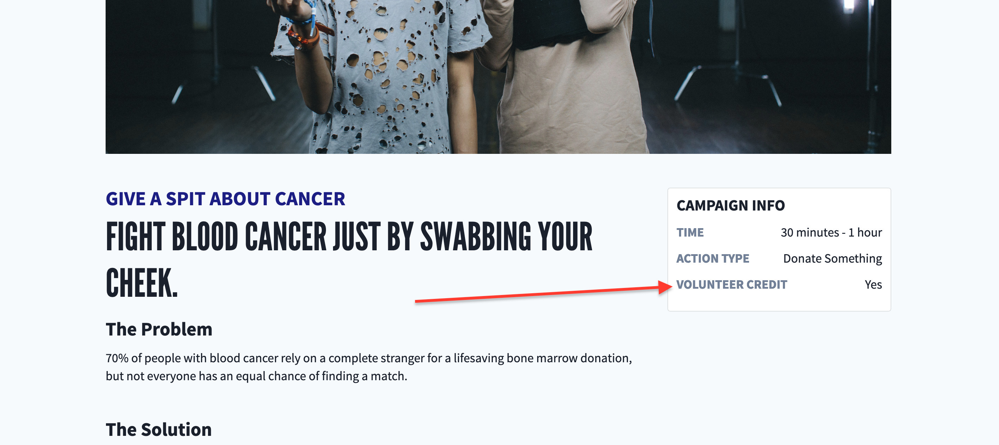

# Volunteer Credits

## Overview

We offer Volunteer Credit certification for certain social good actions on our website.

Once a user has signed up, and reported back for a volunteer credit-worthy campaign, they can navigate to `/us/account/credits` and download a PDF certificate accreditation for their work.

_Currently, the Volunteer Credit features are hidden behind the `DS_ENABLE_VOLUNTEER_CREDITS` environment variable._

## Rogue Actions

In order to denote a particular campaign Action as volunteer credit (VC) worthy, an admin must set the Volunteer Credit (`volunteer_credit`) field to `true`. This can be done from the Rogue website on any particular action page (https://activity.dosomething.org/actions/:id).

## Campaign

Within a Campaign's Info Block, we display whether the campaign's primary action (calculated within the Info Block) earns Volunteer Credit or not.

## Volunteer Credit Certificate Table

If a member has reported back on a campaign action which earns VC, we'll render a table on the `us/account/credits` account page with rows for each distinct VC action with some general information about the campaign & action.

Each row will display:

- Campaign preview meta data (Cover image, title, CTA)
- Action Type
- Completed date (we grab this from the earliest completed post)
- Estimated volunteer hours (the action's 'time commitment label')

If their RB post has been accepted, they'll be able to download their certificate!

Posts pending review will display a grayed out 'Pending' button.

The certificate will include the following data:

- Members first name, last name, and email address
- Campaign title & CTA
- Completed Date
- Estimated volunteer hours
- Impact label using total aggregate impact of all their posts (we tally based on each post's `quantity`)
- Reportback Photo (we grab the earliest 'accepted' photo)

The certificate will be named `dosomething-volunteer-certificate-[campaign-name].pdf`

## Certificate Data Calculation

We calculate and parse the data for the VC table by grabbing all (100 is the technical limit) the user's photo posts (pending or accepted) for actions qualifying for VC, grouping the posts by Action ID, and then parsing out the following data per Action group:

- Action details & campaign meta data from the earliest post
- Pending status based on if any of the posts have an 'accepted' `status` or not
- Impact label (tallying `quantity` from all accepted posts)
- RB photo from the earliest 'accepted' post

## PDF Generation

We use the [`react-pdf` library](https://react-pdf.org/) to generate the PDF on the fly from a [template](https://git.io/JfcpG) built with custom React components.
