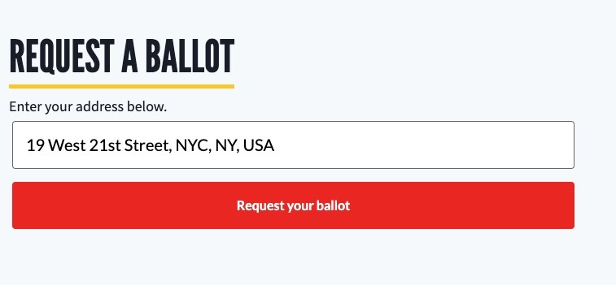

# Voter Registration

## Overview

We partner with [Rock The Vote](https://www.rockthevote.org) to register young people to vote on behalf of DoSomething.org, by redirecting to them to the Rock The Vote (RTV) registration website and appending our partner ID:

> register.rockthevote.com/registrants/new?partner=37187

We can pre-populate the voter registration email address and zip via `email_address` and `home_zip_code` query parameters, which we often include when redirecting an authenticated user on the web:

> rockthevote.com/registrants/new?partner=37187&source=user:58e68d5da0bfad4c3b4cd722,source:web,source_details:onlinedrivereferral,referral=true&email_address=puppet.sloth@dosomething.org&home_zip_code=94116

## Import

Our importer app, [Chompy](https://www.github.com/dosomething/chompy) downloads all voter registrations created with our partner ID, and imports them as `voter-reg` posts by posting to the Rogue API. See [import docs](https://github.com/DoSomething/chompy/blob/master/docs/imports#rock-the-vote) for details.

### Tracking Source

When we redirect to the RTV registration form, we include a `source` query parameter. Per the [RTV docs](https://www.rockthevote.org/programs-and-partner-resources/tech-for-civic-engagement/partner-ovr-tool-faqs/partner-ovr-tool-faqs/), a source parameter is used to:

> track the success of various campaigns, affiliates, social media posts, and more using just one tool.

When we download the RTV reports, each registration contains the `source` query parameter that was present when the user began their registration. The expected values to pass for the `source` are comma-separated `key:value` substrings:

> user:5547be89469c64ec7d8b518d,source:web,source_details:VoterRegQuiz_completed_notsure

This tracking source value is saved within the serialized `details` field of the `voter-reg` post, and is utilized by both the Chompy import and Looker:

-   `user` - This is the Northstar user ID of either the authenticated user registering to vote, or the referring alpha user for a beta registration, when the `referral` key is present.

-   `group_id` - This is the [Rogue group ID](https://github.com/DoSomething/rogue/blob/master/docs/endpoints/groups.md) stored on the campaign signup, if user is sharing their link from a [groups OVRD campaign](development/features/groups.md#online-voter-registration-drives).

-   `source` - This is similar to a `utm_source`.

    -   Examples: `web`, `sms`, `email`

-   `source_detail` - This is similar to a `utm_campaign`.

    -   Examples: [`hellobar`](development/features/sitewide-banner.md), `broadcastID_4YOiqwTVOOVklZFARAFd4h`, `VoterRegQuiz_completed_votebymail`, `onlinedrivereferral`

-   `referral` - If this is set, the `user` parameter should be used as the `referrer_user_id` on the `voter-reg` post.

**Notes**

-   Some older voter registration URLs may contain `campaignID` and `campaignRunID` keys within their tracking source. These have long been deprecated by the import: when we first started on voter registration, we used multiple campaigns. The import would update the `campaignID` and `campaignRunID` values on the `voter-reg` post if present within the tracking source. See [#171090116](https://www.pivotaltracker.com/story/show/171090116) for details.

## Voting Portal

We host our voting portal, [vote.dosomething.org](https://vote.dosomething.org) on Instapage. It displays a form that prompts for email and zip, and redirects them to the Rock The Vote registration URL with our partner ID, pre-populating the email and zip submitted from the form.

When constructing a URL for the voting portal, we include the tracking source via a `r` query parameter, which is then added as a `source` parameter when redirecting the user to the RTV registration site after they enter their email and zip (handled via JS on Instapage).

Example:

> vote.dosomething.org/covid19?r=campaignID:8017,campaignRunID:8022,source:web,source_details:VoterRegQuiz_completed_notsure

### Influencers

We host customized voter registration drives for influencers on our Instapage, by creating pages like https://vote.dosomething.org/NoorAldayeh on Instapage and passing a relevant tracking source when redirecting to the RTV registration site:

> source:influencer,source_details:noor_aldayeh

## Content types

-   [`VoterRegistrationAction`](development/content-types/voter-registration-action.md) - Links to a voting portal page. A `clicked_voter_registration_action` analytics event is fired when the user clicks on the CTA to visit the voter registration portal.

-   [`VoterRegistrationDriveAction`](development/content-types/voter-registration-drive-action.md) - Used in [OVRD campaigns](#online-drives)

-   [`VoterRegistrationReferralsBlock`](development/content-types/voter-registration-drive-action.md) - Used in [OVRD campaigns](#online-drives)

## Utilities

### CivicEngine Voter Widget

A [CivicEngine Voter Widget](https://developers.civicengine.com/docs/widget/) can be embedded in the footer of a [`ContentBlock`](development/content-types/content-block.md#content-type-fields).

The Voter Widget is hosted on BallotReady - for 2020 we subscribed to maintain our own instance of the widget, instead of using the shared TMC instance (switch was made on October 13, 2020 from shared to white-labelled)

-   Note: For the 2018 election, we used a `PollLocator` component which linked to the Voting Information Project. In 2020, we'll instead be using the CivicEngine Voter Widget as a polling locator, so the `PollLocator` component was removed in [#2373](https://github.com/DoSomething/phoenix-next/pull/2373).

### Start Voter Registration Form

The `StartVoterRegistrationForm` component displays form fields for email and zip, and redirects a user directly to the RTV registration site upon submitting. It's currently hardcoded on the [Voter Registration Drive Page](#voter-registration-drive-page) and the [Quiz Result Page](#quiz-result-page) components.

A `clicked_voter_registration_action` analytics event is fired when the user submits the form to continue their voter registration on the RTV registration site.

## Online Drives

The call to action in the [Online Voter Registration Drive (OVRD) campaign](https://www.dosomething.org/us/campaigns/online-registration-drive/) asks a member (the alpha) to get their friends to register to vote, by providing them with a [custom OVRD page URL to share with their friends](development/content-types/voter-registration-drive-action.md) (the betas).

### Voter Registration Drive Page

The `VoterRegistrationDrivePage` is a hardcoded component, displayed on path `/us/my-voter-registration-drive?referrer_user_id=58e68d5da0bfad4c3b4cd722` (where the `referrer_user_id` is our alpha's user ID).

This beta page shares some components with the OVRD campaign pages, like its `CoverImage` and scholarship information. The OVRD campaign's contentful ID, `3pwxnRZxociqMaQCMcGOyc`, is the same in all of our `dev`, `qa` and `production` spaces. Usually this isn't the case -- our Contentful ID's don't match between our `dev` and `production` spaces -- but this entry was created before we introduced different Contentful environments to our Phoenix space. Because of this, we're able to hardcode this Contentful ID to use in both `dev` and `production` environments.

We hardcode specific configuration `ContentBlock` ID's:

**Production:**

-   [Register To Vote ContentBlock](https://app.contentful.com/spaces/81iqaqpfd8fy/entries/2d2i2M3yn4RB9pZYVzQxGm) - 2d2i2M3yn4RB9pZYVzQxGm
-   [FAQ ContentBlock](https://app.contentful.com/spaces/81iqaqpfd8fy/entries/4yP8BdIdiGU0qwZaFyzmsm) - 4yP8BdIdiGU0qwZaFyzmsm
-   [OVRD Campaign Link ContentBlock](https://app.contentful.com/spaces/81iqaqpfd8fy/entries/30rCn63G1rnpzojCXC9PmF) - 30rCn63G1rnpzojCXC9PmF

**Dev:**

-   [Register To Vote ContentBlock](https://app.contentful.com/spaces/81iqaqpfd8fy/environments/dev/entries/bt0jUBYJaKoi1oab25Wmx) - bt0jUBYJaKoi1oab25Wmx
-   [FAQ ContentBlock](https://app.contentful.com/spaces/81iqaqpfd8fy/environments/dev/entries/3cXc0RPMVNeE4surEqFujL) - 3cXc0RPMVNeE4surEqFujL
-   [OVRD Campaign Link ContentBlock](https://app.contentful.com/spaces/81iqaqpfd8fy/environments/dev/entries/3p2qz2JPCvgVitgRVBoMFz) - 3p2qz2JPCvgVitgRVBoMFz

**Notes:**

The initial version of OVRD beta page was hosted on Instapage - https://vote.dosomething.org/member-drives. Example URL:

> vote.dosomething.org/member-drive?userId=${referrerUserId}&r=user:${referrerUserId},source:web,source_details:onlinedrivereferral,referral=true

This page had inline JS that would query Northstar to find a user's first name based on the `userId` query parameter passed.

## Quiz

The Quiz content type is only used for voter registration campaigns.

Users are redirected to `/us/quiz-results/:id` to see their quiz result on a Quiz Result Page.

The `QuizResultPage` component expects the `:id` route parameter to be the ID of one of the Link Action entries referenced by the Quiz's Result Blocks multi-value reference field.

To display the Start Voter Registration Form on a quiz result, add a `sourceDetails` property to the Additional Content field on the quiz result's Link Action entry. This value will be set to the `source_details` of the voter registration tracking source if a user submits the form.

A header image can be added by selecting an asset in the Affiliate Logo field.

A static Gallery Block entry is displayed all for all Quiz result ID's:

-   Production: 78WaGsvDEzAxnreEvNx3Za
-   Dev: 2VGFq3XBcqCfKOA8mC5mP4

### Voting Quiz Campaign

-   Gated: `/us/campaigns/ready-vote` - user must signup to take the quiz from the action page

-   Ungated: `/us/campaigns/ready-vote/quiz/ready` - user can take quiz but must signup to see their result

Production Quiz Results:

-   [p7hqjSP4Y1U6ad0UDz4iS](https://www.dosomething.org/us/quiz-results/p7hqjSP4Y1U6ad0UDz4iS) - Vote By Mail
-   [1giTEF3B2hO2CyccmhlVDm](https://www.dosomething.org/us/quiz-results/1giTEF3B2hO2CyccmhlVDm) - In-Person Voting
-   [21PDBge2bKCTWMe5f9eo1H](https://www.dosomething.org/us/quiz-results/21PDBge2bKCTWMe5f9eo1H) - Unsure of Voting
-   [14KfeAs265httjNMf1jwTw](https://www.dosomething.org/us/quiz-results/14KfeAs265httjNMf1jwTw) - Ineligible to Vote

Dev Quiz Results:

-   [347iYsbykgQe6KqeGceMUk](https://dev.dosomething.org/us/quiz-results/347iYsbykgQe6KqeGceMUk)
-   [1lvJHhlJqQSgKgwIwUymQ8](https://dev.dosomething.org/us/quiz-results/1lvJHhlJqQSgKgwIwUymQ8)
-   [2KfkCOTi7u4CqAyyCuGyci](https://dev.dosomething.org/us/quiz-results/2KfkCOTi7u4CqAyyCuGyci)

**Related links:**

-   [Quiz documentation](https://github.com/DoSomething/phoenix-next/blob/8b5a97fdd973c8eb925191f78b36c2f676d2707a/docs/content-publishing/quiz.md) - This was removed in [#1369](https://github.com/DoSomething/phoenix-next/pull/1369) when we moved editorial guides into the [Campaign Playbook](https://docs.google.com/document/d/1iOFgNNNN0ry9zyyRyxcuLI-tZm2CKkcPLbfUMos9WcI/edit?usp=sharing).

**Notes:**

-   Please avoid editing the Quiz entries if possible, as [they are delicately configured](https://github.com/DoSomething/phoenix-next/blob/8b5a97fdd973c8eb925191f78b36c2f676d2707a/docs/content-publishing/quiz.md#adding-available-choices-for-question) (deleting one of the `LinkAction` entries referenced by the `resultBlocks` field would not be pretty).

## Appendix

Voter registration features built in 2020.

**OVRD**

An OVRD alpha page is a campaign action page, which displays `VoterRegistrationDriveAction` and `VoterRegistrationReferralsBlock` entries in its `blocks` field.

-   [Individual](https://qa.dosomething.org/us/campaigns/online-registration-drive/action)
-   [Group](https://qa.dosomething.org/us/campaigns/nhs-online-voter-registration-drives/action) -- Note, you must join a group from the campaign landing page to avoid action page errors.

The OVRD beta page is hardcoded to render a `VoterRegistrationDrivePage` component at path `/us/my-voter-registration-drive`.

-   [Individual](https://qa.dosomething.org/us/my-voter-registration-drive?referrer_user_id=5547be89469c64ec7d8b518d&voting-reasons=covid-relief%2Cclimate-change%2Cjob-creation%2Cracial-justice%2Cgun-violence)
-   [Group](https://qa.dosomething.org/us/my-voter-registration-drive?group_id=15897&referrer_user_id=5547be89469c64ec7d8b518d&voting-reasons=covid-relief%2Cclimate-change%2Cjob-creation%2Cracial-justice%2Cgun-violence)

**Misc**

-   [Quiz Result (`QuizResultPage`)](https://qa.dosomething.org/us/quiz-results/2byOD44hZk6b8XlmnjGKlm)

-   [Leaderboard (`ActionStatsBlock`)](https://qa.dosomething.org/us/blocks/4p6V5CC5DGqehKkjhfSslN)

-   [GOTV Block (`GetOutTheVoteBlock`)](https://qa.dosomething.org/us/blocks/1og1KarU9jfFFVrQXXJnxU)

-   [CivicEngine Voter Widget (`CivicEngineVoterWidget`)](https://qa.dosomething.org/us/blocks/5Ckp8JDZD9ZlqsIJoNb8ZS)
